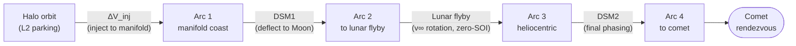
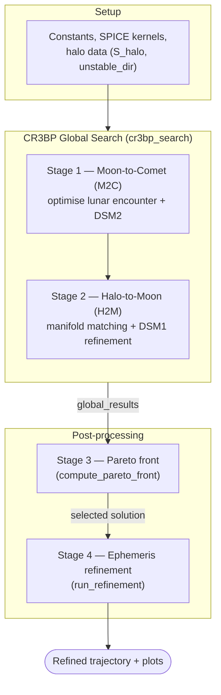
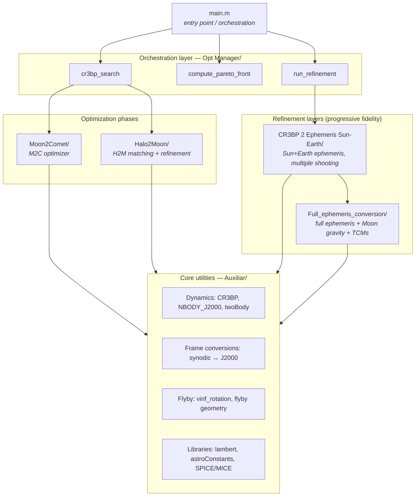
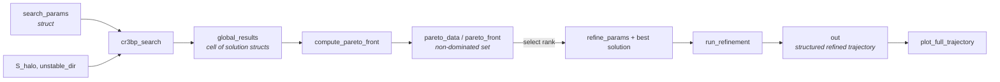
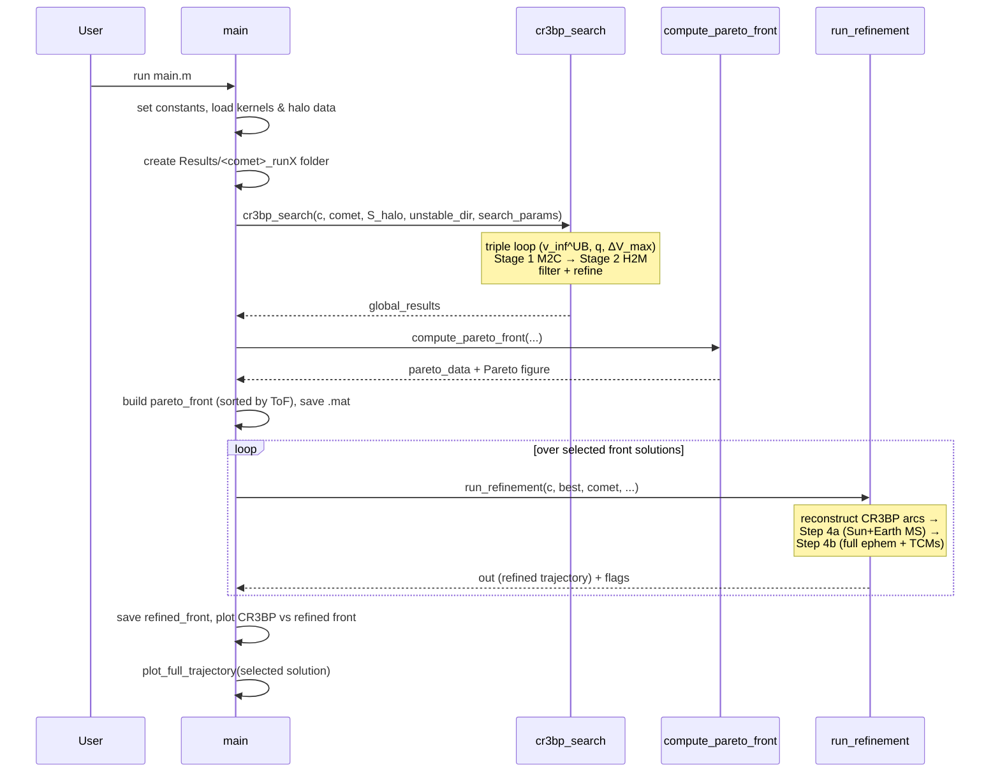

# ESA Comet Interceptor — Trajectory Design and Optimization Framework

**Trajectory design and optimization for the ESA Comet Interceptor mission, exploiting a lunar gravity assist to boost Earth escape from a Sun–Earth L2 halo orbit.**

This repository contains the MATLAB implementation of the *lunar-flyby* departure pipeline described in the study *"Using Lunar Gravity Assists to Boost Earth Escape for the ESA Comet Interceptor Mission"* (Guerriero & Sánchez, ISAE-SUPAERO / CNES). Given the orbital state of a target comet, the framework searches for low-cost, fast transfer trajectories that leave a quasi-halo parking orbit, coast along the unstable manifold, perform an instantaneous lunar swingby, and inject into a heliocentric leg toward the comet — while jointly optimising propellant cost (ΔV) and time of flight (ToF).

---

## Table of Contents

1. [Project Overview](#1-project-overview)
2. [Scientific Background](#2-scientific-background)
3. [The Trajectory Model](#3-the-trajectory-model)
4. [Overall Optimization Workflow](#4-overall-optimization-workflow)
5. [High-Level Architecture](#5-high-level-architecture)
6. [Directory Organization](#6-directory-organization)
7. [Detailed Description of Each Stage](#7-detailed-description-of-each-stage)
8. [Full-Ephemeris Refinement Bridge (GODOT)](#8-full-ephemeris-refinement-bridge-godot)
9. [Data Flow Between Stages](#9-data-flow-between-stages)
10. [Main Modules and Responsibilities](#10-main-modules-and-responsibilities)
11. [Execution Flow](#11-execution-flow)
12. [Design Philosophy](#12-design-philosophy)
13. [How to Navigate the Repository](#13-how-to-navigate-the-repository)
14. [Getting Started](#14-getting-started)
15. [Outputs](#15-outputs)

---

## 1. Project Overview

The ESA Comet Interceptor mission will wait in a quasi-halo orbit around the Sun–Earth **L2** point until a dynamically new long-period comet is discovered. Because the target is unknown at launch, the Earth-escape manoeuvre must be executed **quickly and cheaply** once a comet is identified. The Earth-bound branch of the L2 halo unstable manifold naturally reaches the Earth–Moon system, so a **single lunar gravity assist** can raise the escape velocity and reduce the heliocentric injection cost.

This framework answers a concrete engineering question: **given a target comet, what is the best lunar-flyby transfer, and what is its ΔV/ToF trade-off?** It produces, per target, a **Pareto front** in the ΔV–ToF plane that can be compared against a direct-escape baseline to decide whether a lunar flyby is worthwhile.

> **Scope note.** This repository implements the **lunar-flyby** strategy in the **three-dimensional Sun–Earth Circular Restricted Three-Body Problem (CR3BP)**. The *direct-escape* baseline used for comparison in the paper is a separate, independent implementation and is **not** part of this codebase. Everything here concerns the Moon-flyby pipeline and its refinement toward higher-fidelity dynamics.

**What the framework does, in one paragraph:** It precomputes the halo unstable-manifold flow once, then for each combination of tuning parameters it (i) optimises the *Moon-to-Comet* leg, (ii) matches that lunar encounter back to a natural manifold departure from the halo (*Halo-to-Moon*), (iii) refines the connection, and (iv) collects all converged transfers into a non-dominated ΔV–ToF Pareto front. A selected front solution can then be **refined into progressively higher-fidelity dynamical models** (real Earth/Moon ephemerides, then full Moon gravity with trajectory-correction manoeuvres).

---

## 2. Scientific Background

A minimal set of concepts is needed to read the rest of this document; the paper contains the full treatment.

- **CR3BP & the synodic frame.** The dynamics are the 3D Sun–Earth CR3BP, expressed in a rotating (*synodic*), non-dimensional frame with the Sun–Earth barycentre at the origin, the Sun at `(-mu, 0, 0)` and the Earth at `(1-mu, 0, 0)`. Lengths are scaled by the Sun–Earth distance (`Lstar`), and time/velocity by the corresponding `Tstar` / `Vstar`.
- **Halo orbit & unstable manifold.** The parking orbit is an L2 halo. It is unstable: a small perturbation along the unstable eigendirection makes the spacecraft depart along the invariant manifold. The Earth-bound branch sweeps a *corridor* through the Earth–Moon region.
- **Zero-SOI lunar flyby.** The Moon is treated as a **massless body with zero sphere of influence**. The gravity assist is modelled as an **instantaneous rotation** of the spacecraft's Moon-relative excess velocity vector `v_inf`, bounded by the maximum bending angle achievable at a minimum flyby altitude (`hp = 750 km`).
- **Impulsive manoeuvres.** Three impulses shape the transfer: a small **injection** into the manifold, and two **deep-space manoeuvres** (**DSM1** before the flyby, **DSM2** after it).
- **Design objective.** For a given target, the primary output is the **ΔV–ToF Pareto front**.

---

## 3. The Trajectory Model

The transfer from the halo orbit to the comet is decomposed into **four ballistic arcs** separated by **three impulsive manoeuvres** and **one instantaneous lunar flyby**:

| Event | Symbol | Role | Where in code |
|---|---|---|---|
| Injection | `ΔV_inj` (≈15 m/s) | Perturb along the unstable eigendirection to enter the manifold | applied in `cr3bp_search` / `refinement_halo2moon` |
| Arc 1 → DSM1 | `ΔV_DSM1` | Bend the natural manifold flow toward the desired lunar encounter | `nonlinear_constraints_moon2comet`, `refinement_halo2moon` |
| Lunar flyby | `v_inf` rotation | Free energy: rotate `v_inf` within the max bending angle | `vinf_rotation.m`, `flyby_periapsis_state.m` |
| Arc 3 → DSM2 | `ΔV_DSM2` | Final heliocentric phasing to hit the comet at the prescribed epoch | `get_DSM_info`, `optimization_moon2comet` |
| Comet | — | Position rendezvous at a fixed epoch | boundary condition |

**Engineering logic.** The comet imposes a *rigid* boundary condition (a position at a fixed epoch), whereas the halo departure offers a *continuous one-parameter family* of natural manifold trajectories. This asymmetry drives the whole architecture (see §7).

---

## 4. Overall Optimization Workflow

The pipeline is orchestrated by a single entry point, [`main.m`](main.m), and proceeds through five conceptual stages:

The **CR3BP global search** (Stages 1–2) is wrapped in a **triple nested parametric sweep** that populates the Pareto front. The **ephemeris refinement** (Stage 4) is optional and increases dynamical fidelity for a selected solution.

---

## 5. High-Level Architecture

The codebase is layered by **responsibility** and by **increasing dynamical fidelity**:

The **core utilities** (`Auxiliar/`) implement the shared physics — dynamics, reference-frame conversions, the lunar-flyby model — and are used by every layer above. The **orchestration layer** (`Opt Manager/`) never implements physics directly; it sequences the phase-specific optimizers and post-processing. This separation keeps the dynamical model in a single place and lets each optimization phase remain focused on its own subproblem.

---

## 6. Directory Organization

> The structure reflects the *engineering decomposition* of the problem, not an arbitrary file grouping. Each folder corresponds to a well-defined responsibility in the pipeline.

| Folder | Layer | Responsibility |
|---|---|---|
| **`Auxiliar/`** | Core | Shared physics & utilities: CR3BP and N-body dynamics, synodic ↔ J2000 conversions, the `v_inf`-rotation flyby model, Lambert solver, astrodynamic constants, plotting, and Python/Blender export helpers. |
| `Auxiliar/Checks and tests/` | Validation | Standalone diagnostic tools used to validate the pipeline and analyse results (flyby-geometry checks, Earth-altitude checks, the energy-based escape-velocity study). Not part of the automated pipeline. |
| **`Moon2Comet/`** | Phase | The **Moon-to-Comet (M2C)** optimizer: the 3-stage GA → fmincon → fixed-ToF fmincon optimization of the lunar encounter and DSM2. |
| **`Halo2Moon/`** | Phase | The **Halo-to-Moon (H2M)** stage: builds the halo/Moon manifold databases, performs KD-tree manifold matching, and refines each match into a continuous Halo-to-Moon arc (fixing DSM1). |
| **`Opt Manager/`** | Orchestration | Top-level drivers: `cr3bp_search` (the full nested CR3BP search), `compute_pareto_front` (front extraction), `run_refinement` (ephemeris refinement driver), and the final trajectory plot. |
| **`CR3BP 2 Ephemeris Sun-Earth/`** | Refinement (step 1) | First fidelity upgrade: converts a CR3BP solution into a **real-ephemeris Sun+Earth** model via **multiple shooting** (Moon still zero-SOI). Includes the direct-optimization constraints, initial-guess builder, result organiser, and diagnostics. |
| **`Full_ephemeris_conversion/`** | Refinement (step 2) | Second fidelity upgrade: **full ephemeris with explicit Moon gravity**. Adds trajectory-correction manoeuvres (TCMs) before/after the flyby, B-plane targeting, and pre/post/global-flyby refinement sub-problems. |
| **`GODOT Refinement/`** | External refinement | Python code (ESA **GODOT** library) for the full-ephemeris refinement, fed by the text file exported from MATLAB. **Work in progress** — see [§8](#8-full-ephemeris-refinement-bridge-godot) and the folder's README. |
| **`kernels/`** | Data | SPICE/NAIF kernels (planetary ephemerides, leap seconds, frames) loaded through the meta-kernel `sckernel.tm`. |
| **`Results/`** | Output | One sub-folder per run (`<CometName>_runX`) holding the saved search parameters, solutions, Pareto data, and figures. |
| *(root)* | Entry / data | `main.m` (entry point), `startup.m` (MICE path setup), precomputed halo data (`S_halo.mat`, `unstable_dir.mat`), cache files, and standalone helper scripts. |

**Root-level files worth knowing:**

| File | Purpose |
|---|---|
| [`main.m`](main.m) | **The entry point.** Configures the run, launches the search, extracts the Pareto front, refines a solution, and plots. |
| [`startup.m`](startup.m) | Adds the local **MICE** (MATLAB SPICE) toolkit to the path. **Must be edited to point at your MICE install.** |
| `S_halo.mat`, `unstable_dir.mat` | Precomputed halo-orbit states and unstable eigenvectors (inputs to the manifold generation). |
| `halo_tree.mat`, `halo_manifold.mat`, `manifold_db.mat`, `moontraj_db.mat` | Cached manifold / KD-tree databases (regenerated on demand). |
| `extract_mission_points.m`, `propagate_S_pre_inj.m` | Standalone post-analysis / verification helpers (run manually). |

---

## 7. Detailed Description of Each Stage

This section describes the purpose, inputs, and outputs of each phase. Mathematical formulations and per-function details are intentionally left to the dedicated READMEs inside each folder.

### Stage 0 — Halo data & manifold database (preprocessing)

**Purpose.** Provide the natural dynamical substrate: the parking halo orbit and its unstable manifold flow, discretised and indexed for fast spatial queries.

- The halo orbit states (`S_halo.mat`) and unstable eigenvectors (`unstable_dir.mat`) are precomputed and loaded by `main`.
- `build_halo_manifold_db` perturbs a discretised set of halo departure points along the unstable eigendirection (with `ΔV_inj ≈ 15 m/s`) and propagates them forward in the CR3BP, producing a dense cloud (~10⁶–10⁷ points) of manifold states filtered to keep only those clearing a minimum Earth altitude.
- All sampled points are stored in a **KD-tree** (`KDTreeSearcher`) indexed by trajectory and time. **This tree is built once and reused across all optimization runs** (cached in `halo_tree.mat` / `halo_manifold.mat`).

| | |
|---|---|
| **Inputs** | `S_halo`, `unstable_dir`, constants, search parameters |
| **Outputs** | Halo manifold database + KD-tree (`halo_tree_data`, `manifold_fn`) |

### Stage 1 — Moon-to-Comet (M2C) optimization

**Purpose.** Determine the *best lunar encounter* and the *post-flyby heliocentric leg* that reaches the comet at its prescribed epoch. **This is solved first**, because the comet is the rigid boundary condition.

**Design variables:** lunar excess-velocity magnitude `v_inf`, lunar phase angle `θ_moon`, post-flyby flight-path angle (FPA) and out-of-plane angle (OOP), M2C time of flight, split fraction `β` (locating DSM2 along the leg), and the three DSM2 components.

**Cost function:** a weighted combination of propellant and time, `J = (1-q)·ΔV + q·ToF`, where `q ∈ [0,1]` is swept externally to trace the Pareto front.

**Method:** a three-stage optimization for robustness on this nonconvex, multimodal problem:
1. **Genetic algorithm** — global exploration → initial guess.
2. **fmincon (SQP)** — local gradient refinement of the full variable set.
3. **fmincon with fixed ToF** — a final pass that fixes the time of flight (adjusted to the actual Moon phasing at the flyby epoch) and re-optimises the remaining variables.

| | |
|---|---|
| **Inputs** | Comet position & epoch, `v_inf` bounds, cost weight `q`, maneuver-spacing limits |
| **Outputs** | Optimised lunar-encounter state (pre-flyby `v_inf`, `θ_moon`) and `ΔV_DSM2`, passed to Stage 2 as boundary conditions |
| **Code** | `Moon2Comet/optimization_moon2comet.m` (+ its objective / constraint functions) |

### Stage 2 — Halo-to-Moon (H2M) matching & refinement

**Purpose.** Find *natural* connections between the halo departure and the lunar-encounter condition fixed by Stage 1, and reconcile any residual velocity mismatch with **DSM1**.

**Method — manifold matching:**
- The target pre-flyby state is **back-propagated** in the CR3BP, sampling admissible flyby geometries: the `v_inf` vector is rotated within the **maximum bending angle** `δ_max` on a polar grid of uniform areal density (~`M = 2000` directions). This builds a database of admissible **back-propagated pre-flyby trajectories** (`build_moon_manifold_db`).
- These trajectories are queried against the halo **KD-tree** via a range search (`find_manifold_matches`). Each spatial match is a candidate Halo-to-Moon connection; the local velocity mismatch is the ΔV that **DSM1** must provide.

**Method — filtering & refinement:**
- A **ΔV feasibility filter** discards candidates whose DSM1 exceeds a fraction of the remaining budget (`ΔV_DSM1 ≤ k·ΔV_rem`).
- A **spatial / diversity filter** discards geometrically implausible or redundant matches.
- Each surviving match seeds a **local fmincon** (`refinement_halo2moon`) that produces a continuous Halo-to-Moon arc, **minimising ToF** subject to the total ΔV as a hard constraint.

| | |
|---|---|
| **Inputs** | Lunar-encounter boundary condition (from Stage 1), halo KD-tree, budget & spacing parameters |
| **Outputs** | A set of refined, feasible Halo-to-Moon-to-Comet CR3BP transfers |
| **Code** | `Halo2Moon/build_moon_manifold_db.m`, `find_manifold_matches.m`, `refinement_halo2moon.m` |

### Stage 3 — Parametric sweep (Pareto front assembly)

**Purpose.** A single pass of Stages 1–2 yields transfers for one parameter set. To populate a full trade-off, the entire search is embedded in a **triple nested loop**:

- `v_inf` upper bound `v_inf^UB` — the flyby energy regime;
- cost-function weight `q` — the ΔV-vs-ToF emphasis;
- maximum mission ΔV `ΔV_max` — populates the front along the ΔV axis.

All converged solutions are collected into `global_results`, then `compute_pareto_front` re-propagates each solution to compute its *effective* ΔV (including the DSM1 velocity mismatch) and extracts the **non-dominated front** in the ΔV–ToF plane.

| | |
|---|---|
| **Inputs** | `global_results` (all converged CR3BP transfers), constants, halo data |
| **Outputs** | `pareto_data` / `pareto_front` (front indices, ΔV and ToF vectors, full solution structs) + Pareto figure |
| **Code** | `Opt Manager/cr3bp_search.m` (loop), `Opt Manager/compute_pareto_front.m` |

### Stage 4 — Ephemeris refinement (progressive fidelity)

**Purpose.** Demonstrate that selected CR3BP solutions survive in a realistic dynamical environment with approximately the same ΔV and ToF. Fidelity is increased in **two successive steps**.

**Step 4a — Sun+Earth real ephemeris (multiple shooting).** The CR3BP solution is converted into a model where the Earth and Moon follow their **real ephemeris positions**, but only **Sun + Earth gravity** is integrated (the Moon is still zero-SOI, its effect reproduced by the `v_inf` rotation). The resulting boundary-value problem is solved by **multiple shooting**: the trajectory is split into nodes per phase, and `optimization_ephe` enforces node-continuity, altitude, and budget constraints. This intermediate model is robust and converges in nearly all cases.

- **Code:** `CR3BP 2 Ephemeris Sun-Earth/` — `build_initial_guess_MS`, `optimization_ephe`, `nonlinear_constraints_ephe_multiple`, `variables_organizer`, `check_altitude`.

> **Tuning the number of nodes (important).** The number of multiple-shooting nodes on each leg strongly affects the refinement: too few and the discretised trajectory cannot follow the true dynamics (the optimisation drifts away from the CR3BP solution), too many and the optimisation becomes prohibitively slow. The node count is not set directly but through the variable **`days_per_node`** in [`main.m`](main.m) — roughly one node every *N* days, per phase — from which `k_vec` (the number of nodes per leg) is derived for each solution.
>
> **Recommended workflow:** pick a value of `days_per_node`, look at the initial-guess plot, and check how closely the multiple-shooting reconstruction overlaps the original CR3BP trajectory. If it diverges noticeably, **decrease `days_per_node`** (more nodes); if it already matches well, **do not add nodes needlessly** — an over-dense discretisation can make the optimisation take forever. To inspect the guess *before* committing to the (expensive) refinement, place a breakpoint / temporary debug stop at the plotting call around **line 252 of [`run_refinement.m`](Opt%20Manager/run_refinement.m)**: it shows the node layout and the reconstructed trajectory, so you can validate the discretisation — and abort the run — before the optimiser starts.

**Step 4b — Full ephemeris with Moon gravity (TCMs).** The Moon's gravity is now **explicitly integrated**. To absorb the perturbation, two **trajectory-correction manoeuvres (TCMs)** are added a few days before and after the flyby, and the flyby is targeted through its **B-plane**. The refinement is split into pre-flyby and post-flyby sub-problems.

- **Code:** `Full_ephemeris_conversion/` — `bplane_from_vinf`, `bplane_tcm`, the `Refinement pre flyby/`, `Refinement post flyby/`, `Refinement global post flyby/` sub-problems, and `variables_organizer_refined`.

| | |
|---|---|
| **Inputs** | A selected front solution (`best`), constants, halo data, refinement parameters |
| **Outputs** | `out` — a structured, fully-refined trajectory (all states, epochs, and manoeuvres in synodic + J2000), plus convergence flags |
| **Code** | `Opt Manager/run_refinement.m` (driver) |

> **Note.** As stated in the paper, the full-ephemeris step (4b) is **not fully robust** across all solutions; a general-purpose refinement pipeline (e.g. building on ESA GODOT) is left to future work. Step 4a converges reliably.

---

## 8. Full-Ephemeris Refinement Bridge (GODOT)

Beyond the internal refinement of Stage 4, the framework is designed to **hand off a trajectory to an external, higher-fidelity refinement** written in Python on top of **ESA's GODOT** library. That external code lives in the [`GODOT Refinement/`](GODOT%20Refinement/) folder, and the interface between the two worlds is a **plain-text export file** produced on the MATLAB side.

### The export function

The bridge is implemented by [`write_python_inputs`](Auxiliar/write_python_inputs.m) (and its variant `write_python_inputs_serot`) in [`Auxiliar/`](Auxiliar/), called by `run_refinement` once a CR3BP/ephemeris solution has been assembled.

- **What it produces.** A `.txt` file containing everything the downstream tool needs to reconstruct the trajectory: the key mission states (post-injection, pre-injection, post-DSM1, flyby periapsis, post-DSM2), the segment durations, and the comet encounter date.
- **Frames.** `write_python_inputs` writes the states in the **non-dimensional CR3BP synodic** frame; `write_python_inputs_serot` writes the *same* information in the **dimensional, Earth-centred SEROT** (Sun–Earth rotating) frame, i.e. positions in km and velocities in km/s — the form convenient for the ephemeris-based Python side.

### Why it exists

The MATLAB pipeline produces a self-consistent trajectory but stops at the fidelity level described in Stage 4. The `.txt` file exists to **link this MATLAB optimisation process to the full-ephemeris refinement process in Python/GODOT**: the MATLAB side exports the converged trajectory, and the Python side re-imports it as the initial guess for a high-fidelity, real-ephemeris refinement. This decouples the two environments — the search/optimisation stays in MATLAB, the final high-fidelity propagation can be delegated to GODOT — communicating through a single, human-readable interface file.

> The Python/GODOT code in [`GODOT Refinement/`](GODOT%20Refinement/) is a **work in progress** (see that folder's README). The export functions on the MATLAB side are complete and produce the interface file regardless.

---

## 9. Data Flow Between Stages

The pipeline is best understood as a series of transformations on a few well-defined data objects:

**Key data objects:**

| Object | Produced by | Consumed by | Contents |
|---|---|---|---|
| `search_params` | `main` | `cr3bp_search` | All sweep bounds, filter thresholds, spacing limits, manifold resolution |
| `global_results` | `cr3bp_search` | `compute_pareto_front` | One struct per converged transfer: optimal variables (`x_opt`, `result_fmincon`), matched manifold data, ToF, ΔV components |
| `pareto_data` / `pareto_front` | `compute_pareto_front` | `main`, `run_refinement` | Front indices, ΔV/ToF vectors, and the full solution structs, sorted by ToF |
| `refine_params` | `main` | `run_refinement` | Budget, min flyby altitude, node counts per phase, method flags |
| `out` (`out_cr3bp` / refined) | `variables_organizer[_refined]` | plots, `check_altitude`, exports | Canonical trajectory: `departure`, `injection`, `dsm1`, `tcm1`, `flyby`, `tcm2`, `dsm2`, `comet` — each with states (synodic + J2000), epochs, and ΔV |

The **`out` struct is the central data structure** of the refinement layers: every arc, epoch, and manoeuvre is stored in both synodic (non-dimensional) and J2000 (dimensional) form, so any downstream tool (plotting, altitude checks, Python/Blender export) reads a single, consistent object.

---

## 10. Main Modules and Responsibilities

### `Auxiliar/` — core physics & utilities

| Module | Responsibility |
|---|---|
| `CR3BP.m` / `CR3BP_STM.m` | CR3BP equations of motion (and STM variant) — the backbone dynamics. |
| `NBODY_J2000.m` / `NBODY_J2000_full_ephe.m` / `NBODY_J2000_mod.m` | N-body dynamics with SPICE ephemerides (Sun+Earth; Sun+Earth+Moon; homotopy variant). Used by the refinement layers. |
| `vinf_rotation.m` | The **lunar-flyby model**: rotates the `v_inf` vector (in-plane + out-of-plane). |
| `flyby_periapsis_state.m` | Reconstructs the flyby-hyperbola periapsis state from patched-conics `v_inf`. |
| `car2synodic` / `synodic2car` / `sun_J2000_to_synodic` / `synodic2sun_J2000` | Reference-frame conversions between inertial J2000 and the CR3BP synodic frame. |
| `lambert.m` | Robust Lambert solver (used for the DSM2 heliocentric leg). |
| `astroConstants` / `getAstroConstants` | Standard astrodynamic constants. |
| `plot_comets_synodic`, `plot_trajectory_heliocentric`, `plot_paper_trajectory` | Visualisation of comets, trajectories, and publication figures. |
| `write_python_inputs[_serot]` | Export a trajectory to a text file — the interface toward the external Python/GODOT full-ephemeris refinement (see [§8](#8-full-ephemeris-refinement-bridge-godot)). |

### `Moon2Comet/` — M2C optimizer

`optimization_moon2comet` (3-stage GA → fmincon → fixed-ToF fmincon) plus its objective functions (`objective_function_moon2comet_{ga,fmincon,tof}`), nonlinear constraints (`nonlinear_constraints_moon2comet[_tof]`), the analytic Moon state (`moon_state`), and the DSM decomposition helper (`get_DSM_info`).

### `Halo2Moon/` — H2M matching & refinement

`build_halo_manifold_db` and `build_moon_manifold_db` (manifold databases), `find_manifold_matches` (KD-tree range search + greedy diversity selection), `refinement_halo2moon` with its objective/constraints (`OF_refinement_moon2comet`, `NC_refinement_halo2moon`), and `state_finder` (nearest halo point by phase angle).

### `Opt Manager/` — orchestration

`cr3bp_search` (the complete nested search combining Stages 0–2), `compute_pareto_front` (front extraction + figure), `run_refinement` (ephemeris-refinement driver), `plot_trajectory` (final plot wrapper).

### `CR3BP 2 Ephemeris Sun-Earth/` — refinement step 1

`optimization_ephe` (multiple-shooting optimizer), `nonlinear_constraints_ephe[_multiple]` and `objective_function_ephe`, `build_initial_guess_MS` (node initial guess), `variables_organizer` (assemble the `out` struct), `check_altitude` (Earth/flyby altitude verification), and MS/synodic plotting helpers.

### `Full_ephemeris_conversion/` — refinement step 2

`bplane_from_vinf` / `bplane_tcm` (B-plane targeting), the `Refinement pre flyby/`, `Refinement post flyby/`, and `Refinement global post flyby/` sub-problems (each an objective + nonlinear-constraint + driver triplet), and `variables_organizer_refined` (assemble the refined `out` struct with TCMs).

### `Auxiliar/Checks and tests/` — validation

Standalone tools, run manually against a saved result set: `verify_flyby_geometry` (flyby geometry / B-plane visual check), `earth_altitude_check` and `flyby_bending_check` (feasibility screens), `vinf_escape_study` (the energy-based ballistic-escape-velocity analysis), and `compare_vinf_sampling` / `rotation_test` (sampling and sign-convention checks).

---

## 11. Execution Flow

Running [`main.m`](main.m) executes the following sequence:

**In practice, the run is driven by a handful of switches near the top of `main.m`:** the target comet, the sweep vectors (`vinf_ub_vec`, `q_vec`, `maximum_dv_vec`), the manifold resolution and matching thresholds, the refinement budget/altitude, and the refinement method (fast vs. global). A typical workflow is to run once with a coarse sweep and inspect the printed Pareto table; the refinement loop then refines the front solutions — all of them by default, or a specific one by editing the loop bound (`for ii = ...`) — and the index `k` selects which refined trajectory to plot.

---

## 12. Design Philosophy

The architecture embodies a few deliberate engineering choices:

- **One dynamical model, applied consistently.** The entire search lives in the 3D Sun–Earth CR3BP so that halo departure, lunar encounter, and heliocentric leg are dynamically consistent. The Moon is massless / zero-SOI and the flyby is an instantaneous `v_inf` rotation — a deliberate trade of fidelity for speed that is *later validated* by the ephemeris refinement.

- **Boundary-condition-driven phase ordering.** Because the comet is a rigid constraint and the halo departure is a free family, the transfer is solved **backwards**: M2C first (fix the lunar encounter that reaches the comet), then H2M (find a natural manifold departure that produces that encounter). This ordering is the single most important architectural decision.

- **Precompute once, reuse everywhere.** The halo manifold database and its KD-tree are the expensive part; they are built once and reused across every optimization run, reducing the nearest-neighbour search from O(n) to O(log n) and making the parametric sweep tractable.

- **Global-then-local optimization.** Each phase pairs a global, derivative-free search (genetic algorithm) with a local gradient solver (fmincon). The global stage escapes the many local minima of the nonconvex problem; the local stage delivers precision.

- **Parametric sweep to expose trade-offs.** No single "optimum" is sought. A triple nested sweep produces a *family* of solutions from which the non-dominated ΔV–ToF front — the true engineering deliverable — is extracted.

- **Progressive fidelity as a validation strategy.** Rather than solving the hardest model directly, the pipeline climbs a fidelity ladder (CR3BP → Sun+Earth ephemeris → full ephemeris + Moon gravity), each step reusing the previous solution as an initial guess.

- **Separation of concerns.** Physics lives in `Auxiliar/`; each optimization phase owns its subproblem; orchestration sequences them; refinement layers are isolated by fidelity. A change to the dynamics touches one place; a change to a phase does not affect the others.

- **A single canonical trajectory object.** All refinement and post-processing operate on the `out` struct (states in both synodic and J2000, all epochs and manoeuvres), so tools compose without bespoke glue.

---

## 13. How to Navigate the Repository

Suggested reading order for a new user:

1. **This README** — the mental model.
2. **[`main.m`](main.m)** — the executable table of contents; every stage is called here in order, with the user-configurable parameters at the top.
3. **`Opt Manager/cr3bp_search.m`** — how Stages 0–2 are wired together and swept.
4. **`Moon2Comet/optimization_moon2comet.m`** — the M2C phase (Stage 1).
5. **`Halo2Moon/`** (`build_moon_manifold_db` → `find_manifold_matches` → `refinement_halo2moon`) — the H2M phase (Stage 2).
6. **`Opt Manager/compute_pareto_front.m`** — how the front is assembled (Stage 3).
7. **`Opt Manager/run_refinement.m`** — the fidelity ladder (Stage 4), which then dispatches into `CR3BP 2 Ephemeris Sun-Earth/` and `Full_ephemeris_conversion/`.
8. **`Auxiliar/`** — consult as needed for the underlying physics (`CR3BP`, `vinf_rotation`, the frame conversions).

Every `.m` file begins with a header documenting its purpose, inputs, and outputs. Detailed, component-level documentation (for the nonlinear constraints and individual optimization phases) lives in the README inside each relevant folder.

---

## 14. Getting Started

### Requirements

| Requirement | Notes |
|---|---|
| **MATLAB** | Developed on a recent release. |
| **Optimization Toolbox** | `fmincon`, `ga`. |
| **Parallel Computing Toolbox** | `parpool` / `UseParallel` (speeds up the GA and matching; optional). |
| **Statistics Toolbox** | `KDTreeSearcher`, and `ksdensity` for some diagnostic plots (optional). |
| **MICE (SPICE for MATLAB)** | NAIF SPICE toolkit; ephemerides and time conversions. Download: <https://naif.jpl.nasa.gov/naif/toolkit_MATLAB.html> |
| **SPICE kernels** | Provided in `kernels/` and loaded via the meta-kernel `sckernel.tm`. |

### Setup

1. **Install MICE.** Download the MATLAB MICE toolkit from the official NAIF page — <https://naif.jpl.nasa.gov/naif/toolkit_MATLAB.html> — and unpack it locally.
2. **Configure the MICE path.** Edit [`startup.m`](startup.m) so its `addpath` lines point at the **absolute path of your own local MICE installation** (`.../mice/lib` and `.../mice/src/mice`). The placeholder paths in `startup.m` **must** be replaced with your machine's actual install location, or every `cspice_*` call will fail.
3. Ensure the `kernels/` folder is present; `main.m` loads it with `cspice_furnsh({'kernels/sckernel.tm'})`.
4. Open `main.m`, select the target comet (`selected_comet`) and adjust the sweep / refinement parameters in the *User-configurable parameters* block.
5. Run `main.m`.

> On the first run the manifold database and KD-tree are built and cached; subsequent runs reuse them. The search is computationally heavy — start with a coarse sweep.

---

## 15. Outputs

Each run creates a dedicated folder `Results/<CometName>_runX/` (the run number auto-increments) containing:

| File | Content |
|---|---|
| `search_params.mat` | The exact search configuration used. |
| `global_results.mat` | All converged CR3BP transfers. |
| `pareto_data.mat` | The computed Pareto data (all solutions + non-dominated set). |
| `pareto_front.mat` | The Pareto front repackaged and sorted by ToF. |
| `refine_params.mat` | The refinement configuration. |
| `refined_front.mat` | The ephemeris-refined front solutions. |
| `pareto_front.fig` | The ΔV–ToF Pareto-front figure. |
| `out_cr3bp.mat` | The organized CR3BP solution handed to the ephemeris refinement (`variables_organizer` output), written by `run_refinement`. |
| `python_inputs.txt` | The trajectory exported for the Python/GODOT refinement, in the **synodic non-dimensional CR3BP** frame (see [§8](#8-full-ephemeris-refinement-bridge-godot)). |
| `python_inputs_serot.txt` | The same export in the **Sun–Earth rotating (SEROT)** frame. |

> **Note.** `out_cr3bp.mat`, `python_inputs.txt` and `python_inputs_serot.txt` are produced inside the `run_refinement` loop and **overwritten on each refined solution**, so they always reflect the last solution refined in the run. They now land in the run folder rather than the project root. The optional `blender_input.json` visualization export is disabled.

Additionally, the run prints a ranked Pareto table to the console and generates trajectory plots (synodic and heliocentric views, CR3BP-vs-refined front comparison). The energy-level validation (`vinf_escape_study`) and geometric checks are run separately, on a saved result set, from `Auxiliar/Checks and tests/`.

---

*This document is the primary entry point for understanding the framework. It describes the workflow and architecture; the mathematical formulations and per-function contracts belong to the source-file headers and to the README inside each folder.*
